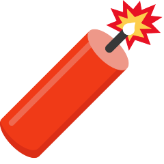
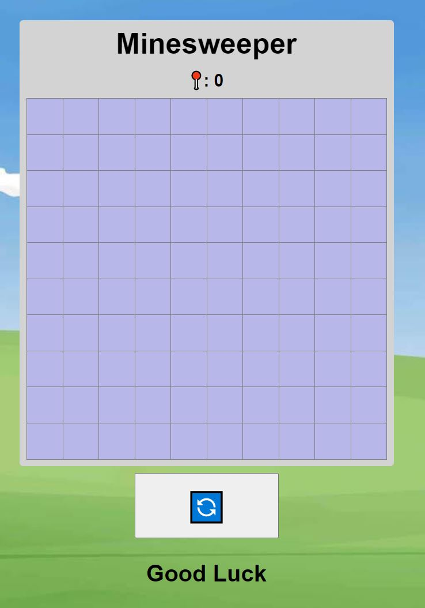
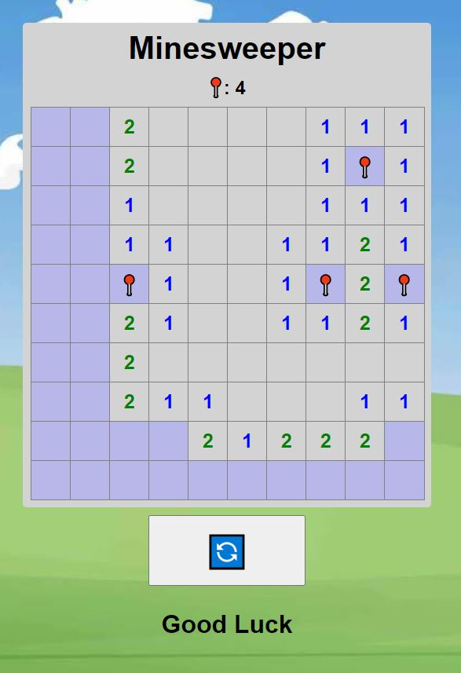
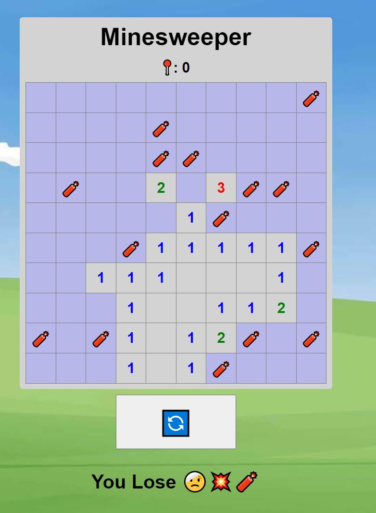

   

# Roy John Lee
**Created by [Roy John Lee](https://www.linkedin.com/in/roy-john-lee-018443173/)**
### [CLICK TO PLAY](https://royjohnlee.github.io/Minesweeper/)

  
   
  [Linkedin](https://www.linkedin.com/in/roy-john-lee-018443173/)
   

## 📝 Description
A single-player logic-based computer game played on rectangular board whose object is to locate a predetermined number of randomly-placed "mines" by clicking on "safe" tile while avoiding the tile with mines.

## 🏆 How to Win
To win a round of Minesweeper, you must click on the board every tile that doesn't have a mine under it.

However, If you accidentally click a tile is a mine beneath it, the game will be over. You'll have the option of starting a new game.

## :camera_flash: Screenshots
| |**Gameplay**|
|:------------:|:------------:|
| | 
| | 
| | 

## 👨‍💻 Languages Used

## 🖥️ Technology Used

## 🖊️  Getting Started

 Instructions 

1. When entering the site, the game is all ready to play!
2. `Left-Click` to reveal a tile
3. If the player clicks on tile thats a mine, the game ends.
4. If the player clicks on a tile that is not a mine, A number between 0 and 8 is displayed that identifies the total number of mines present in the eight neighboring squares.
5. If there is no mines around the clicked tile, it well reveal neighboring tiles
6. `Right-Click` to suspect a tile that is a mine.
7. if the exact amount of mines are flagged, then the player wins.

## :satellite: Upcoming Features

- [:x:] Corresponding sounds for flagging a tile, triggering a mine, winning, and losing
- [:x:] Play background music

- [:x:] All the Tiles will be revealed when player wins.

- [:x:] When the game is lost, display a indicator that tells you any flagged tile that DOESN'T have a mine.
- [:x:] Stopwatch that indicates how long it took a player to complete the game and have a LeaderBoard for the fastest time.

